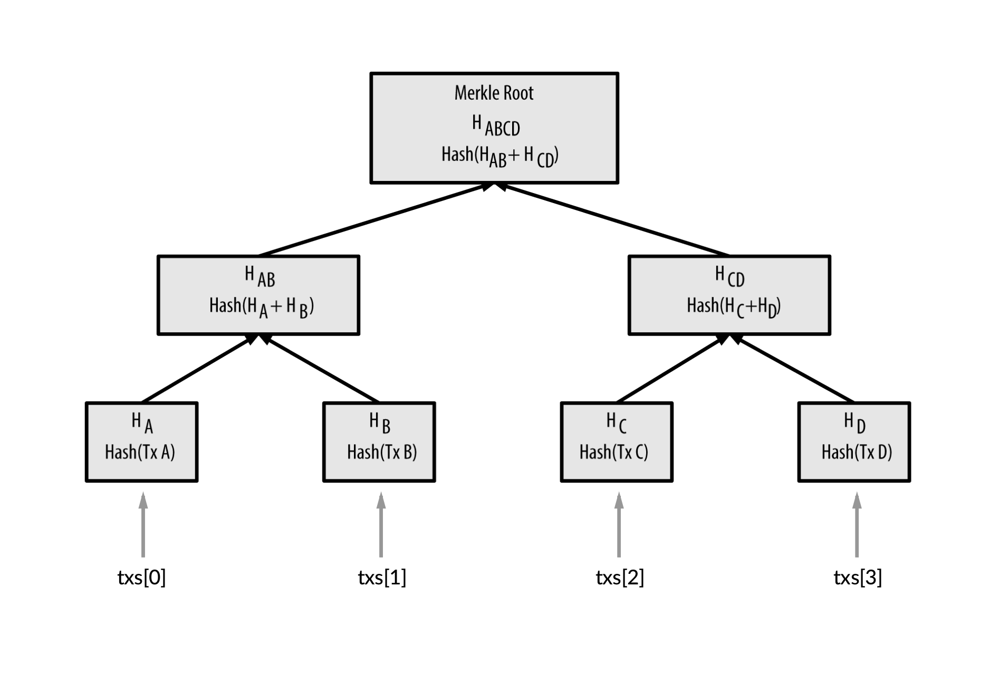

# Project 1: Building Blocks
 
## Due Date

This project is due on *Friday, September 21st at 11:59:59PM*. The late deadline is *Monday, September 24th at 11:59:59PM* for 15% penalty.

## Goal

In this project, you'll get to build simplified blocks that would go on bitcoin's blockchain.
- You'll have to create merkle trees from a list of transactions
- You'll have to find the proper nonce for a block

## Setting Up

Before starting this project, run `git pull` in the `389Cfall18` directory to update your local copy of the class repository. This will pull in the Block.java and PublicTests.java files, as well as the external JARs you need for the hashing and testing libraries.  

If you have not already cloned the class repository, run `git clone https://github.com/UMD-CS-STICs/389Cfall18.git`. This will automatically pull in the most up-to-date files.

### Eclipse Instructions

1. Open Eclipse
2. Click File -> Import...
3. Under General, select "Projects from Folder or Archive", then click next.
4. Click Directory, then navigate to and select the "project_01" folder and open it. Then click Finish.
5. Next, you must select all 3 jar files in the project's "lib" folder. Right click them while selected, choose -> "Build Path" -> "Add to Build Path".
6. Your project should be set up correctly at this point. Make sure the public tests will run (and fail), and happy coding!

### IntelliJ Instructions

1. Open IntelliJ
2. Click "Import Project"
3. Click "Next" until the dialogue is finished
   * Make sure you are using JDK 1.8
   * Once you click "Finish", IntelliJ should create all of the appropriate folders for you and source your jar files correctly.
4. Done! If you open the PublicTests file and click run, it should run smoothly! (You will fail all the tests though since you haven't implemented any code yet.)
5. You are now free to implement the methods in the Block file.

### Command Line Instructions

When using the command line, you can use whatever text editor you like (such as Emacs, Vim, or Sublime Text). Whenever you want to run the public tests to check your progress, do the following:
1. `export CLASSPATH=".:/path/to/jar/guava-23.6-jre.jar:/path/to/jar/hamcrest-core-1.3.jar:/path/to/jar/junit-4.12.jar"`
   * On Windows, separate the jars by semicolon, not a comma
   * You only have to do this once per Terminal session
2. `javac PublicTests.java`
   * Note that since PublicTests.java uses Block.java, it will automatically compile both files
3. `java org.junit.runner.JUnitCore PublicTests`
4. Done! PublicTests will now run and you can see the results of the public tests.

## Getting Started

### Block Components

Recall that there are three main components to a block:
- The previous block header
- The merkle root of your transaction list
- The proper nonce

**Note:** When you are hashing all of the data together, the byte arrays need to be contatenated in the following order into one large byte array: (1) previous block header, (2) merkle tree root, (3) nonce. 

#### Previous Block Header

The previous block header will be given to you as a byte array. This is needed in order for you to create the proper block hash, and will go first in the order of the data you hash in the end.

#### Merkle Root

You will be given a list of transactions that is guaranteed to be a power of 2 (2, 4, 8, 16, etc). You will need to group your transactions together in order (i.e., `0-1, 2-3, 4-5, ..., (n - 2)-(n - 1)`) so that you can hash the proper merkle root together with the previous block hash and nonce. It should look something like this:

There are two public tests that will let you know that you are building your merkle trees correctly (testBuildMerkleTree1 and testBuildMerkleTree2).

**Note:** You do not have to hash each individual transaction before building your merkle tree. The list of transactions will be given to you as a list of hashes, so you can just start building the tree straight away. Also, while we call this data structure a "tree," you are only returning one hash that represents the entire tree (the root).

#### Nonce

Finally, the nonce is a number such that, hashed with the previous block header and proper merkle root, gives a hash that has the required number of leading 0s. In order to find the proper nonce, you will need to start at 0 and increment by 1 until you find the correct hash. You are guaranteed that the nonce is between 0 and 100,000 (inclusive). For this lab, you will only need **two** leading 0s in your byte array to constitute a valid block. 

**Note:** When you are hashing your nonce together with the other block data, you will need to represent the nonce as a byte array using the provided method intToByteArray.

### Block Validation

For this lab, in addition to building blocks from scratch you will also have to validate a block given a set of information. That information includes:
- The previous block header
- The merkle root of the current block
- The nonce of the current block
- The hash of the current block

In real life, when blocks are published, the metadata of the block is published along with the block's hash. In order to check that a block is valid, several assertions must hold true, but for this class we will focus on these 2 assertions:
- The hash of the current block must have the correct number of leading zeros (2)
- Hashing together the previous block header, the merkle root, and the nonce should equal the hash of the current block

You must implement the `isValidBlock` method that checks these assertions given a previous block hash, merkle root, nonce, and target hash.

## Submission

When you are finished, submit a zip file to the submit server containing **only** Block.java.
